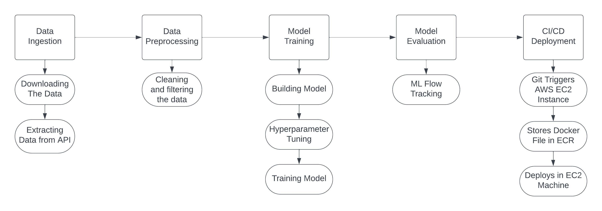

# Zillow Real Estate Data (ZILLOW)

## Overview

The Zillow Real Estate Data (ZILLOW) data feed provides comprehensive real estate market indicators such as market indices, rental rates, sales figures, and inventory levels for thousands of geographical areas across the United States.

### Publisher

Zillow, a leader in real estate and rental marketplaces, is dedicated to empowering consumers with data, inspiration, and knowledge about their living spaces, and connecting them with top local professionals for assistance.

## Coverage & Data Organization

### Coverage

This data feed includes 10 indicators across 3 categories:
- Home Values
- Rentals
- Sales and Inventories

The covers over 700 regions in the U.S.

### Data Organization

The Project focussess on following Categories
- **Metro Area & USA**

## Access

This product is accessible via the Nasdaq Data Link's Tables API.

- **Web Access:** [Zillow Data on Nasdaq Data Link](https://data.nasdaq.com/databases/ZILLOW)

- **API Access:**
  ```plaintext
  https://data.nasdaq.com/api/v3/datatables/ZILLOW/DATA?qopts.export=true&api_key={API_KEY}
  ```
  Replace `{API_KEY}` with your actual API key.

### Python Access:

To access this data using Python, you can use the Quandl library. First, install the library using pip if you haven't already:

```bash
pip install quandl
```

Then, you can use the following script to access the data:

```python
import quandl
quandl.ApiConfig.api_key = '{API_KEY}'  # Replace with your actual API key
data = quandl.get_table('ZILLOW/DATA')
print(data)
```

Note: Ensure you replace `{API_KEY}` with your actual Quandl API key.


## Tables and Columns

### Tables

1. **Zillow Data (ZILLOW/DATA):** Values for all indicators.
2. **Zillow Indicators (ZILLOW/INDICATORS):** Names and IDs of all indicators.
3. **Zillow Regions (ZILLOW/REGIONS):** Names and IDs of all regions.

### Column Definitions

#### ZILLOW DATA (ZILLOW/DATA)
- `indicator_id` (String): Unique indicator identifier (Primary Key, Filterable)
- `region_id` (String): Unique region identifier (Primary Key, Filterable)
- `date` (Date): Date of data point
- `value` (Double): Value of data point

#### ZILLOW INDICATORS (ZILLOW/INDICATORS)
- `indicator_id` (String): Unique indicator identifier (Primary Key, Filterable)
- `indicator` (String): Name of indicator
- `category` (String): Category of indicator

#### ZILLOW REGIONS (ZILLOW/REGIONS)
- `region_id` (String): Unique region identifier (Primary Key, Filterable)
- `region_type` (String): Region type (Filterable)
- `region` (String): Region description (Filterable)

## User Installation Guide

Welcome to the Zillow Data ML Project! Follow these instructions to get this project running on your local machine for development and testing. If you're planning on deploying this project in a live environment, refer to our deployment guidelines.

### Prerequisites

Before you begin, ensure you have the following tools installed and ready:

- **Airflow**: For scheduling and orchestrating the data pipelines.
- **Python**: For writing pipelines and data science scripts.
- **Docker**: Essential for packaging the project into containers, making it easy to deploy in AWS.
- **DVC**: Data Version Control, to manage and version the datasets and ML models.
- **Git/GitHub**: To clone the repository and manage the project's source code.

### Installation Steps

#### 1. Cloning the Repository

Start by cloning the repository to your local machine:

```command line
git clone https://github.com/MurariHarish/Zillow-data-ML-project
```

Navigate into the project directory:

```bash
cd Zillow-data-ML-project
```

#### 2. Setting Up the Environment

Create a new Conda environment specifically for this project:

```bash
conda create -n zillowvenv python=3.10 -y
```

Activate the newly created environment:

```bash
conda activate zillowvenv
```

#### 3. Installing Dependencies

Install all the required Python packages:

```bash
pip install -r requirements.txt
```

#### 4. Docker Configuration

Set up Docker environment variables:

```commandline
echo -e "AIRFLOW_UID=$(id -u)" > .env
echo "AIRFLOW_HOME_DIR=$(pwd)" >> .env
```

Initialize and start Airflow services using Docker Compose:

```commandline
docker compose up airflow-init
docker compose up
```

## Project Pipeline Structure

Here's an overview of the folder structure for the project:

```plaintext
Zillow-data-ML-project/
├── artifacts/
│   ├── models/
│   │   └── [model files]
├── dags/
│   ├── airflow_main.py
├── config/
│   └── config.yaml
├── .github/
│   └── workflows/
│       └── [workflow files]
├── templates/
│   └── index.html
├── notebook/
│   └── [jupyter notebooks]
├── src/
│   └── ZillowHouseData/
│       ├── pipeline/
│       ├── config/
│       ├── entity/
│       ├── constants/
│       ├── utils/
│       └── components/
├── main.py
├── app.py
├── setup.py
├── params.yaml
├── requirements.txt

```
## Data Processing Pipeline Flowchart


# MLOps Tools Overview

In our project, we employ a suite of advanced tools to streamline our machine learning operations (MLOps). Each tool plays a critical role in the development, deployment, and maintenance of our machine learning models.

The tools used in our project include:

- GitHub Actions
- Docker
- Apache Airflow
- DVC (Data Version Control)
- Amazon Web Services (AWS)
- MLflow
- TensorFlow
- Flask

# GitHub Actions Configuration for MLOps

## Workflows Overview

GitHub Actions is a CI/CD platform that automates the software workflows. The project leverages GitHub Actions to automate our development and deployment pipelines. Two distinct workflows are configured to trigger upon new commits to the main branch, ensuring a robust and continuous integration and deployment (CI/CD) process.

### `Workflow: Python application test`

The first workflow, designated for testing, is initiated by any `push` or `pull_request` event. It encompasses the following steps:

- **Setup**: Checks out the code and sets up Python 3.10.
- **Dependency Installation**: Upgrades `pip`, installs `pytest`, and any necessary packages defined in `requirements.txt`.
- **Execution of Tests**: Runs tests using `pytest` to ensure code integrity with each new change.

## `Workflow: Continuous Integration and Deployment`

The second workflow is centered around continuous integration and deployment. This workflow is automatically triggered upon any `push` to the `main` branch, with an exception in place to ignore changes made to the `README.md` file.

## Continuous Integration

The workflow begins with the *Continuous Integration* job, which involves:

- **Code Checkout**: The latest version of the code is retrieved from the repository.
- **Code Linting**: Static code analysis is performed to identify potential improvements and ensure code quality.
- **Unit Testing**: Automated tests are run to verify the functionality of the code.

### Continuous Delivery

Upon successful integration, the *Continuous Delivery* job takes over with the following steps:

- **AWS Configuration**: Sets up the AWS credentials necessary for accessing AWS services.
- **ECR Login**: Authenticates to Amazon Elastic Container Registry (ECR) to enable image push and pull.
- **Docker Operations**: Builds the Docker image, tags it appropriately, and then pushes this image to Amazon ECR.

### Continuous Deployment

The final phase of the workflow is the *Continuous Deployment* job, which operates on a self-hosted runner and executes the following tasks:

- **Image Deployment**: Pulls the latest Docker image from Amazon ECR.
- **Container Management**: Runs the Docker container to serve the application to users.
- **System Pruning**: Cleans up the system by removing any unused Docker images and containers to maintain a clean deployment environment.


## Docker
Docker is a containerization platform that packages an application and its dependencies in a virtual container that can run on any Linux server. This provides flexibility and portability on where the application can run, whether on-premises, in public cloud, or in a private cloud. Docker streamlines the development lifecycle by allowing developers to work in standardized environments using local containers which provide your applications and services.

## Apache Airflow
Apache Airflow is an open-source tool that helps to schedule and orchestrate complex data pipelines. By defining workflows as code, they can be more dynamic, maintainable, and transparent. We use Airflow to ensure that the right tasks are executed at the right time, handling dependencies across our data pipeline.

## DVC (Data Version Control)
DVC brings agility, traceability, and reproducibility to data science projects. It enables you to track changes in data, code, and machine learning models, and it integrates seamlessly into existing Git workflows. DVC is used in our project to handle large data files, data sets, machine learning models, and metrics associated with the models.

## Amazon Web Services (AWS)
Amazon Web Services offers a broad set of global cloud-based products including compute, storage, databases, analytics, networking, and more. In our project, AWS provides reliable, scalable, and inexpensive cloud computing services. We utilize AWS to deploy and manage our machine learning models, as well as to handle various aspects of data storage and processing.

## MLflow
MLflow is an open-source platform to manage the ML lifecycle, including experimentation, reproducibility, and deployment. It offers four primary functions: tracking experiments to record and compare parameters and results, packaging ML code in a reproducible way, managing and deploying models from a variety of ML libraries, and centralizing model storage. We leverage MLflow to track our experiments and manage the deployment of models into production.

## TensorFlow
TensorFlow is an end-to-end open-source platform for machine learning. It has a comprehensive, flexible ecosystem of tools, libraries, and community resources that lets researchers push the state-of-the-art in ML, and developers easily build and deploy ML-powered applications. In our project, TensorFlow is used to build and train our neural network models.

## Flask
Flask is a micro web framework written in Python. It's simple and easy to use, making it an excellent choice for prototyping and building web applications. We use Flask to create APIs for our machine learning models, allowing them to be easily accessed by other applications or services.


