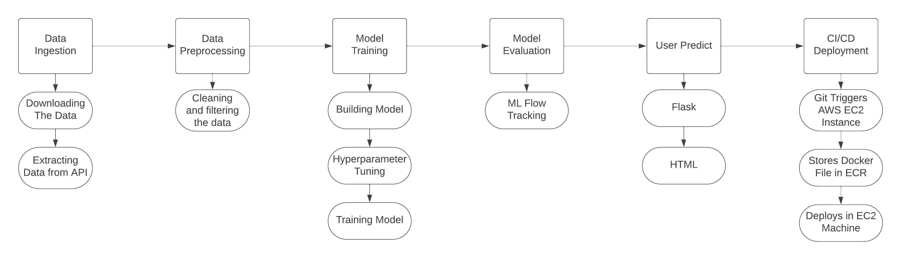
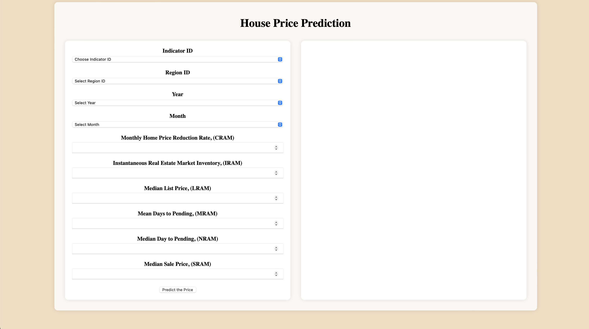
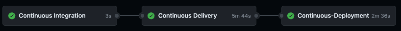
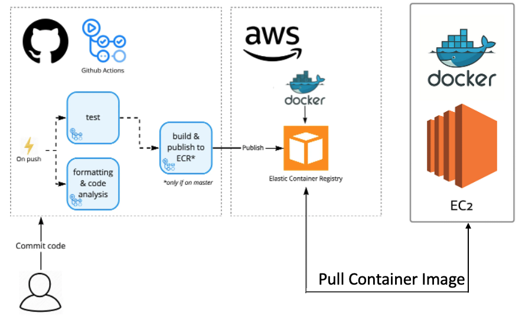

# Zillow Real Estate Data (ZILLOW)

## Overview

The Zillow Real Estate Data (ZILLOW) data feed provides comprehensive real estate market indicators such as market indices, rental rates, sales figures, and inventory levels for thousands of geographical areas across the United States.

### Publisher

Zillow, a leader in real estate and rental marketplaces, is dedicated to empowering consumers with data, inspiration, and knowledge about their living spaces, and connecting them with top local professionals for assistance.

## Coverage & Data Organization

### Coverage

This data feed includes 10 indicators across 3 categories:
- Home Values
- Rentals
- Sales and Inventories

The covers over 700 regions in the U.S.

### Data Organization

The Project focussess on following Categories
- **Metro Area & USA**

## Access

This product is accessible via the Nasdaq Data Link's Tables API.

- **Web Access:** [Zillow Data on Nasdaq Data Link](https://data.nasdaq.com/databases/ZILLOW)

- **API Access:**
  ```plaintext
  https://data.nasdaq.com/api/v3/datatables/ZILLOW/DATA?qopts.export=true&api_key={API_KEY}
  ```
  Replace `{API_KEY}` with your actual API key.

### Python Access:

To access this data using Python, you can use the Quandl library. First, install the library using pip if you haven't already:

```bash
pip install quandl
```

Then, you can use the following script to access the data:

```python
import quandl
quandl.ApiConfig.api_key = '{API_KEY}'  # Replace with your actual API key
data = quandl.get_table('ZILLOW/DATA')
print(data)
```

Note: Ensure you replace `{API_KEY}` with your actual Quandl API key.


## Tables and Columns

### Tables

1. **Zillow Data (ZILLOW/DATA):** Values for all indicators.
2. **Zillow Indicators (ZILLOW/INDICATORS):** Names and IDs of all indicators.
3. **Zillow Regions (ZILLOW/REGIONS):** Names and IDs of all regions.

### Column Definitions

#### ZILLOW DATA (ZILLOW/DATA)
- `indicator_id` (String): Unique indicator identifier (Primary Key, Filterable)
- `region_id` (String): Unique region identifier (Primary Key, Filterable)
- `date` (Date): Date of data point
- `value` (Double): Value of data point

#### ZILLOW INDICATORS (ZILLOW/INDICATORS)
- `indicator_id` (String): Unique indicator identifier (Primary Key, Filterable)
- `indicator` (String): Name of indicator
- `category` (String): Category of indicator

#### ZILLOW REGIONS (ZILLOW/REGIONS)
- `region_id` (String): Unique region identifier (Primary Key, Filterable)
- `region_type` (String): Region type (Filterable)
- `region` (String): Region description (Filterable)

## User Installation Guide

Welcome to the Zillow Data ML Project! Follow these instructions to get this project running on your local machine for development and testing. If you're planning on deploying this project in a live environment, refer to our deployment guidelines.

### Prerequisites

Before you begin, ensure you have the following tools installed and ready:

- **Airflow**: For scheduling and orchestrating the data pipelines.
- **Python**: For writing pipelines and data science scripts.
- **Docker**: Essential for packaging the project into containers, making it easy to deploy in AWS.
- **DVC**: Data Version Control, to manage and version the datasets and ML models.
- **Git/GitHub**: To clone the repository and manage the project's source code.

# MLOps Tools Overview

In our project, we employ a suite of advanced tools to streamline our machine learning operations (MLOps). Each tool plays a critical role in the development, deployment, and maintenance of our machine learning models.

The tools used in our project include:

- GitHub Actions
- Docker
- Apache Airflow
- DVC (Data Version Control)
- Amazon Web Services (AWS)
- MLflow
- Flask

### Installation Steps

#### 1. Cloning the Repository

Start by cloning the repository to your local machine:

```command line
git clone https://github.com/MurariHarish/Zillow-data-ML-project
```

Navigate into the project directory:

```bash
cd Zillow-data-ML-project
```

#### 2. Setting Up the Environment

Create a new Conda environment specifically for this project:

```bash
conda create -n zillowvenv python=3.10 -y
```

Activate the newly created environment:

```bash
conda activate zillowvenv
```

#### 3. Installing Dependencies

Install all the required Python packages:

```bash
pip install -r requirements.txt
```

#### 4. Docker Configuration

Set up Docker environment variables:

```commandline
echo -e "AIRFLOW_UID=$(id -u)" > .env
echo "AIRFLOW_HOME_DIR=$(pwd)" >> .env
```

Initialize and start Airflow services using Docker Compose:

```commandline
docker compose up airflow-init
docker compose up
```

## Project Pipeline Structure

Here's an overview of the folder structure for the project:

```plaintext
Zillow-data-ML-project/
├── artifacts/
│   ├── models/
│   │   └── [model files]
├── dags/
│   ├── airflow_main.py
├── config/
│   └── config.yaml
├── .github/
│   └── workflows/
│       └── [workflow files]
├── templates/
│   └── index.html
├── notebook/
│   └── [jupyter notebooks]
├── src/
│   └── ZillowHouseData/
│       ├── pipeline/
│       ├── config/
│       ├── entity/
│       ├── constants/
│       ├── utils/
│       └── components/
├── main.py
├── app.py
├── setup.py
├── params.yaml
├── requirements.txt

```
## Data Processing Pipeline Flowchart


# Model Evaluation Pipeline

## Overview

The `ModelEvaluatePipeline` class orchestrates the evaluation of the trained machine learning model. It achieves this by executing a series of steps:

1. **Model Loading**: Retrieves the saved Keras model from the filesystem.
2. **Data Preparation**: Loads the scaled test dataset (`X_test_scaled`) and the true labels (`y_test`).
3. **Model Evaluation**: Utilizes the loaded model to predict on the test data and computes performance metrics such as Mean Squared Error (MSE), Root Mean Squared Error (RMSE), and R-squared (R2).

### Evaluation Metrics

The performance of the model is quantified using the following metrics:

- **MSE (Mean Squared Error)**: Measures the average squared difference between the estimated values and the actual value.
- **RMSE (Root Mean Squared Error)**: The square root of MSE which measures the standard deviation of the residuals.
- **R2 (R-squared)**: Represents the proportion of the variance for the dependent variable that's explained by the independent variables in the model.

## MLflow Integration

MLflow is an open-source platform for the complete machine learning lifecycle. Within our pipeline, MLflow is used to log parameters, metrics, and models, ensuring reproducibility and tracking of experiments.

### MLflow Setup

- For the purpose of tracking model performance within our team, MLflow tracking URI is set to a remote server hosted on DagsHub. [MLflow Tracking URI](https://dagshub.com/MurariHarish/Zillow-data-ML-project.mlflow/#/experiments/0)
- A user can also track the model performance in local server by updating the tracking uri in the terminal as shown below.

```bash
mlflow.set_tracking_uri("http://127.0.0.1:5001")
```
run 
```bash
mlflow ui
```

### Logging with MLflow

During the evaluation, the following elements are logged:

- **Parameters**: The parameters used for the model, loaded from a pickle object.
- **Metrics**: The calculated MSE, RMSE, and R2 metrics are logged for each run.
- **Model**: The trained model is logged in MLflow under the name "FeedForwardModel".

# User Prediction Pipeline

## Overview

The `UserPredictPipeline` class is the core of our prediction infrastructure. It loads a pre-trained Keras model and a scaler object, both used to process user inputs and make predictions.

To predict a new data point, the user fills out a web form with the necessary indicators and submits it. The Flask application parses this input and uses the `UserPredictPipeline` to generate a prediction.

### Prediction Process

Upon receiving input from the user, the pipeline performs the following steps:

1. **User Input Processing**: Transforms the raw user input into a format suitable for prediction.
2. **Prediction**: Uses the model and scaler to predict the output based on the user input.

## Flask Web Application Integration

The prediction pipeline is integrated into a Flask web application, providing an interactive user interface for input submission and result display. The application handles:

- **Data Point Prediction**: A web form captures user input, which is then parsed, validated, and fed into the prediction pipeline.
- **Training Invocation**: An endpoint is exposed to trigger model retraining, allowing for continuous improvement of the prediction model.

### Endpoints

- `/`: The main endpoint that renders the prediction form and displays the predicted result.
- `/train`: Endpoint to initiate the model training process.

## Local Development

For local development and testing, the application can be run on `localhost` with the command: ```python app.py```

## Webpage


# Model Deployment Pipeline

## GitHub Actions Configuration for MLOps

GitHub Actions is a CI/CD platform that automates the software workflows. The project leverages GitHub Actions to automate our development and deployment pipelines. Two distinct workflows are configured to trigger upon new commits to the main branch, ensuring a robust and continuous integration and deployment (CI/CD) process.

### `Workflow: Python application test`

The first workflow, designated for testing, is initiated by any `push` or `pull_request` event. It encompasses the following steps:

- **Setup**: Checks out the code and sets up Python 3.10.
- **Dependency Installation**: Upgrades `pip`, installs `pytest`, and any necessary packages defined in `requirements.txt`.
- **Execution of Tests**: Runs tests using `pytest` to ensure code integrity with each new change.

### `Workflow: Continuous Integration and Deployment`

The second workflow is centered around continuous integration and deployment. This workflow is automatically triggered upon any `push` to the `main` branch, with an exception in place to ignore changes made to the `README.md` file.



### Continuous Integration

The workflow begins with the *Continuous Integration* job, which involves:

- **Code Checkout**: The latest version of the code is retrieved from the repository.
- **Code Linting**: Static code analysis is performed to identify potential improvements and ensure code quality.
- **Unit Testing**: Automated tests are run to verify the functionality of the code.

### Continuous Delivery

Upon successful integration, the *Continuous Delivery* job takes over with the following steps:

- **AWS Configuration**: Sets up the AWS credentials necessary for accessing AWS services.
- **ECR Login**: Authenticates to Amazon Elastic Container Registry (ECR) to enable image push and pull.
- **Docker Operations**: Builds the Docker image, tags it appropriately, and then pushes this image to Amazon ECR.

### Continuous Deployment

The final phase of the workflow is the *Continuous Deployment* job, which operates on a self-hosted runner and executes the following tasks:

- **Image Deployment**: Pulls the latest Docker image from Amazon ECR.
- **Container Management**: Runs the Docker container to serve the application to users.
- **System Pruning**: Cleans up the system by removing any unused Docker images and containers to maintain a clean deployment environment.

## AWS configuration for MLOps
Following is comprehensive walkthrough for how I deployed the application using AWS services with the integration of GitHub Actions. It covers the entire process from setting up necessary AWS resources to configuring GitHub Actions for seamless CI/CD.



### 1. AWS Console Access
Ensure to have access to the AWS console. This is essential for creating and managing the necessary AWS resources.

### 2. IAM User Creation
Create an IAM user specifically for deployment purposes. This user should have the following permissions:
- **`AmazonEC2FullAccess`**: Required for managing EC2 instances, which are virtual machines in AWS.
- **`AmazonEC2ContainerRegistryFullAccess`**: Essential for storing Docker images in AWS.

### 3. ECR Repository Setup
Create an ECR repository to store Docker images. Note down the repository's URI for future reference.

### 4. EC2 Instance Creation
Create an EC2 instance, with an Ubuntu operating system, t2.large as CPU and 32 GB as Memory

### 5. Docker Installation on EC2
Connect the EC2 instance and install Docker. This involves:

#### Optional Preparations:
```bash
sudo apt-get update -y
sudo apt-get upgrade -y
```

#### Required Installation Steps:
```bash
curl -fsSL https://get.docker.com -o get-docker.sh
sudo sh get-docker.sh
sudo usermod -aG docker ubuntu
newgrp docker
```

### 6. Configuring EC2 as a Self-Hosted Runner
Set up the EC2 instance as a self-hosted runner for GitHub Actions:
- Navigate to `Settings > Actions > Runners`.
- Click `New self-hosted runner`.
- Choose ```Linux``` Operating Systerm
- Follow the provided instructions to execute the necessary commands in the EC2 instance.

### 7. Setting up GitHub Secrets
Configure the following secrets in GitHub repository for secure access:
- `AWS_ACCESS_KEY_ID`: AWS access key.
- `AWS_SECRET_ACCESS_KEY`: AWS secret access key.
- `AWS_REGION`: Preferred AWS region (e.g., `us-east-1`).
- `AWS_ECR_LOGIN_URI`: The login URI for AWS ECR.
- `ECR_REPOSITORY_NAME`: The name of the ECR repository.

# DVC (Data Version Control)
DVC brings agility, traceability, and reproducibility to data science projects. It enables you to track changes in data, code, and machine learning models, and it integrates seamlessly into existing Git workflows. DVC is used in our project to handle large data files, data sets, machine learning models, and metrics associated with the models.

# Model Monitoring

# Cost Analysis Report
A breakdown of the costs associated with the Continuous Integration and Deployment pipeline, hosted on AWS and utilizing GitHub Actions.

## Initial Cost Analysis
- **Amazon EC2 Instance (t2.large, 32 GB, Ubuntu OS)**
  - Monthly cost: Approximately $73.00

- **Amazon ECR Storage (3.5 GB Docker Image)**
  - Monthly cost: Approximately $0.35

- **Amazon S3 Bucket**
  - Monthly Cost: Approximately $0.20

- **AWS Quicksight**
  - Monthly Cost: Approximately $30.85

**Total Estimated Monthly Cost: $104.40**

**Note**: These costs are rough estimates. The actual costs may vary based on specific usage patterns, additional services used, and pricing changes. Users are encouraged to use the AWS Pricing Calculator for more detailed and current cost estimates.


# Model Efficiency Report

# Handling Data Drift and Data Decay

# Sample Predictions


## Docker
Docker is a containerization platform that packages an application and its dependencies in a virtual container that can run on any Linux server. This provides flexibility and portability on where the application can run, whether on-premises, in public cloud, or in a private cloud. Docker streamlines the development lifecycle by allowing developers to work in standardized environments using local containers which provide your applications and services.

## Apache Airflow
Apache Airflow is an open-source tool that helps to schedule and orchestrate complex data pipelines. By defining workflows as code, they can be more dynamic, maintainable, and transparent. We use Airflow to ensure that the right tasks are executed at the right time, handling dependencies across our data pipeline.


